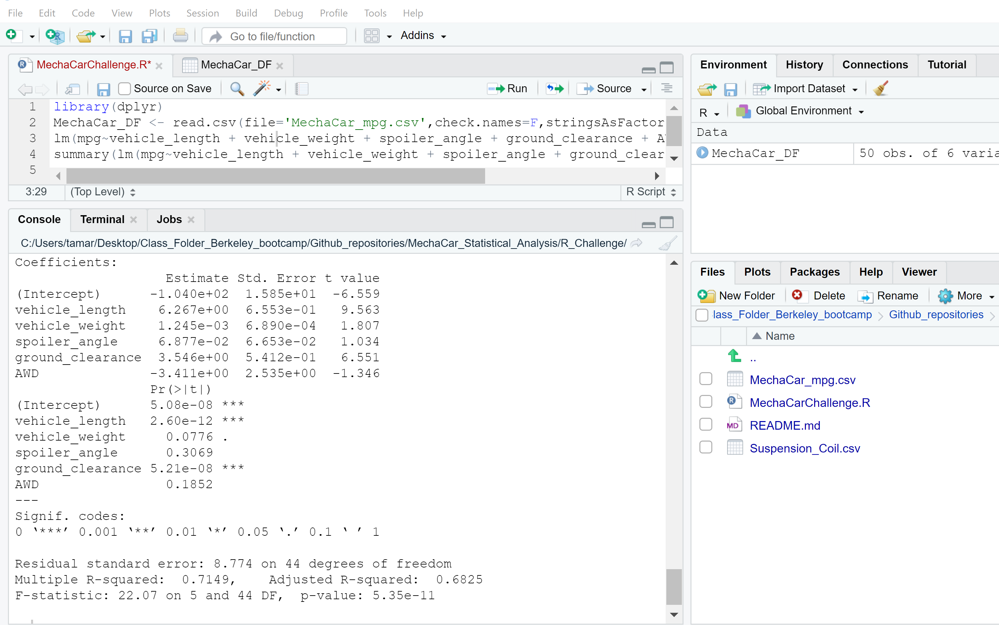

# MechaCar_Statistical_Analysis

## Linear Regression to Predict MPG

The variables/coefficients that provided a non-random amount of variance to the mpg values in the dataset are vehicle length p value = 2.60e-12, and ground clearance p value = 5.21e-08 and questionably vehicle weight p value = 0.0776. This means that the relationship between each of these variables and mpg is significant.  

The slope of the linear model is not zero. Since there is a significant linear relationship between some of the variables and mpg, the dependent values are not determined by random chance. The null hypothesis that says that the slope of the linear model is 0 is not true. 

Does this linear model predict mpg of MechaCar prototypes effectively? Why or why not?
 We use the r-squared value of the model to determine if the model sufficiently predicts our dependent variable. Here the r-squared value equals 0.7149. This means that there is about a 70% chance that future data points will fit the linear model. This is not perfect but also it is prety good. There may be other variables that were not included in this analysis that would explain the rest of the behavior that this model does not predict. 

## Link to image of results on RStudio

