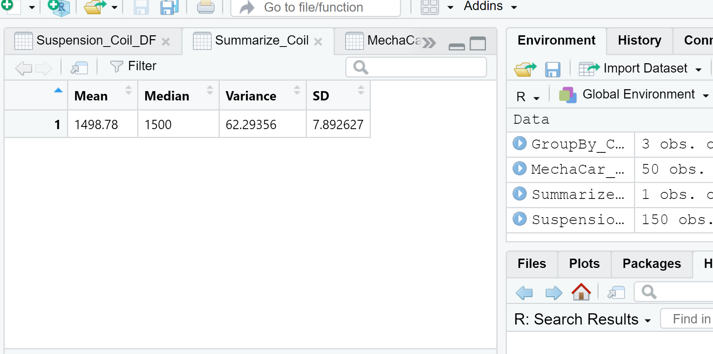
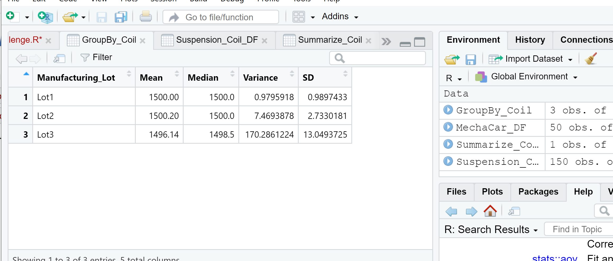
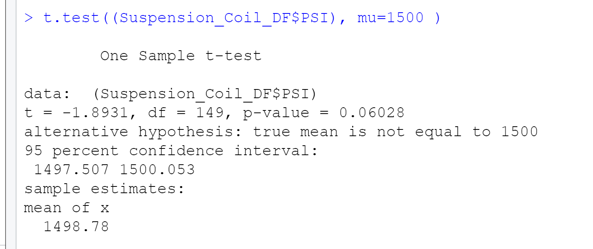
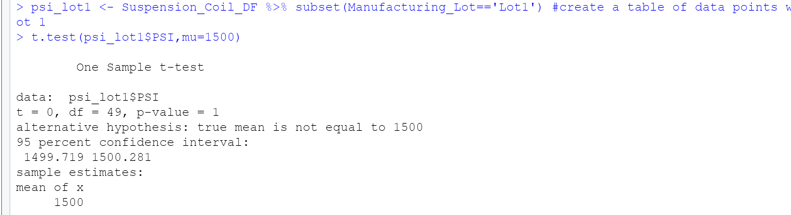
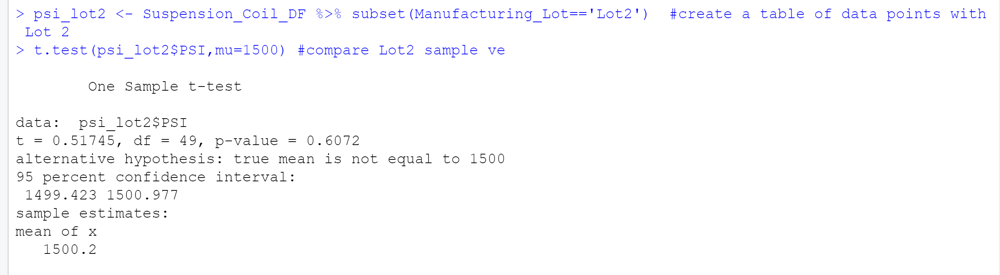
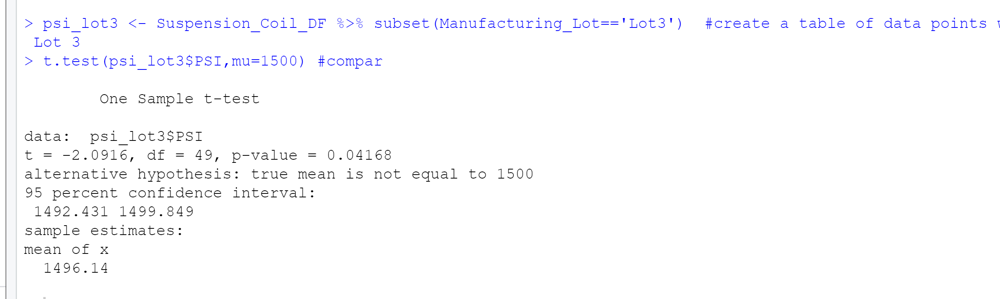

# MechaCar_Statistical_Analysis

---

### Link to R code

---

## Linear Regression to Predict MPG

The variables/coefficients that provided a non-random amount of variance to the mpg values in the dataset are vehicle length p value = 2.60e-12, and ground clearance p value = 5.21e-08 and questionably vehicle weight p value = 0.0776. This means that the relationship between each of these variables and mpg is significant.  

The slope of the linear model is not zero. Since there is a significant linear relationship between some of the variables and mpg, the dependent values are not determined by random chance. The null hypothesis that says that the slope of the linear model is 0 is not true. 

Does this linear model predict mpg of MechaCar prototypes effectively? Why or why not?
 We use the r-squared value of the model to determine if the model sufficiently predicts our dependent variable. Here the r-squared value equals 0.7149. This means that there is about a 70% chance that future data points will fit the linear model. This is not perfect but also it is prety good. There may be other variables that were not included in this analysis that would explain the rest of the behavior that this model does not predict. 

### Results of Linear Regression

---

## Summary Statistics on Suspension Coils

The design specifications for the MechaCar suspension coils dictate that the variance of the suspension coils must not exceed 100 pounds per square inch. The current manufacturing data meets this design specification for two out of the 3 manufacturing lots. The variance for lot 1 is 0.9795918. The variance for lot 2 is 7.4693878. Both very low meaning that the manufacturing process is consistent for lot 1 and lot 2. However, lot 3 the variance is large. it is 170.2861224. It exceeds the design specifications aand it means that the manufacturing process is not consistent for lot 3. When looking at the total variance for all lots together, the variance is 62.29356. This meets the design specifications. It is lower than 100 pounds per square inch. 

### Resuts of Total Summary Statistics on Suspension Coils

### Resuts of Lot Summary Statistics on Suspension Coils

---

## T-Tests on Suspension Coils
The results of the t-tests are: for all lots together, the p-value=0.06028 for a 95% confidence interval, this means that the population mean is not significantly different than the lots mean. But if it was smaller than 0.05 it would be significant. When looking at each of the lots separately, the p-value for lot1=1. This basically means that the means of the sample and the population are essentially the same. The p-value for lot2=0.6072 so we do not have sufficient evidence to reject the null hypothesis, and we would state that the two means are statistically similar. The p-value for lot3= 0.04168. Assuming a confidence interval of 95%, there is a significant difference between the two means. In lot3 we reject the null hypothesis. 

### Resuts of t-test for All Lots

### Resuts of t-test for Lot 1

### Resuts of t-test for Lot 2

### Resuts of t-test for Lot 3

---

## Study Design: MechaCar vs Competition

A study to compare MechaCar to their competition I chose a two-sample t-test to compare the cost of the cars of each company throughout the US. The independent variable would be the car company: this is a dichotomous data type: sample A=MechaCar, sample B=competition company. The dependent variable would be the price. This is a continuous variable. 
 
The null hypothesis would be that there is no statistical difference between the price of the cars in company A to the price of the cars in company B in different locations in the US. With a confidence interval of 95%, if the p-value is lower than 0.05, there would be a significant difference in price between the companies. 

The reason I would use a two-sample t-test is because I am trying to find out whether there is a significant difference in price of cars between the companies. Each company data would be one sample.  

The data needed to run the test is the price of the cars in company A vs. the price of the cars in company B in different locations throughout the US.

